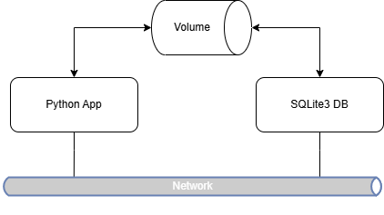
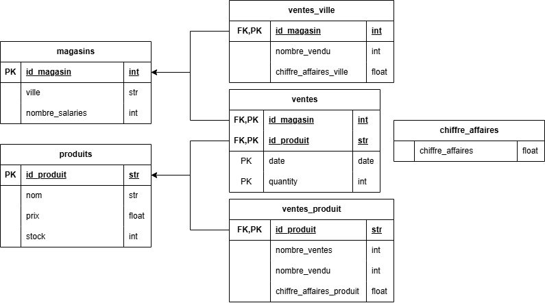

# 📊 Projet d'analyse des ventes 

Ce projet consiste à concevoir une architecture simple pour analyser les ventes d'une PME, en utilisant SQLite, Docker, et Python.

## 🚀 Objectifs

- Concevoir une architecture en deux services (exécution de scripts + base de données SQLite)
- Collecter des données en ligne (produits, magasins, ventes)
- Construire une base relationnelle
- Réaliser des analyses SQL sur les ventes :
  - Chiffre d'affaires total
  - Ventes par produit
  - Ventes par ville

---

## 🏗️ Architecture

Deux services Docker :

| Service | Rôle | Volumes/Ports |
|--------|------|----------------|
| `app` | Exécute les scripts Python d'import et d'analyse | Monté sur `./data:/usr/src/app/data` |
| `db` | Fournit une CLI SQLite pour accéder à la base (`ventes.db`) | `./data:/workspace` |

Les deux services partagent un réseau Docker et un volume `data/` contenant la base SQLite.





---

## 🧱 Structure du projet

```
projet-ventes/
├── data/                  ← Volume et base SQLite stockée ici
├── scripts/               ← Scripts Python
│   ├── init_db.py
│   ├── analyser_ventes.py
│   └── config.py        ← Fichier de configuration
├── Dockerfile
├── docker-compose.yml
└── requirements.txt
```

---

## ⚙️ Pré-requis

- Docker

---

## 🧪 Utilisation

### 1. 🔨 Construire l'image et lancer les conteneurs

```bash
docker compose up --build
```

### 2. 🧬 Lancer le conteneur d'analyse

```bash
docker compose run app python analyser_ventes.py
```

---

## 📎 Sources des données (CSV)

- Produits : [Lien CSV](https://docs.google.com/spreadsheets/d/e/2PACX-1vSawI56WBC64foMT9pKCiY594fBZk9Lyj8_bxfgmq-8ck_jw1Z49qDeMatCWqBxehEVoM6U1zdYx73V/pub?gid=714623615&single=true&output=csv)
- Magasins : [Lien CSV](https://docs.google.com/spreadsheets/d/e/2PACX-1vSawI56WBC64foMT9pKCiY594fBZk9Lyj8_bxfgmq-8ck_jw1Z49qDeMatCWqBxehEVoM6U1zdYx73V/pub?gid=760830694&single=true&output=csv)
- Ventes : [Lien CSV](https://docs.google.com/spreadsheets/d/e/2PACX-1vSawI56WBC64foMT9pKCiY594fBZk9Lyj8_bxfgmq-8ck_jw1Z49qDeMatCWqBxehEVoM6U1zdYx73V/pub?gid=0&single=true&output=csv)

---

## 🙋 Auteur

Marko Macanovic
